# Architect-Led Agent Swarm Specification

**Full Vision — v0.5 Draft**

> [!NOTE]
> This is the complete vision. See `agent_swarm_spec_v1.md` for the minimal v1 scope.

---

## 1. Overview

A three-tier agent hierarchy (Designer → Dispatcher → Worker) that uses standard software engineering primitives—**Git Worktrees, GitHub PRs, and Markdown Plans**—to enable autonomous development with human approval gates.

**Tech Stack:** Node.js application with CLI + Web Dashboard (v2+)

```mermaid
flowchart TB
    Human["👤 Human"] <--> Designer["🏛️ Designer Agent"]
    Designer -->|"commits plan.md"| Plans["📁 plans/"]
    Dispatcher["🤖 Dispatcher"] -->|reads| Plans
    Dispatcher -->|spawns| Worker["⚙️ Worker Agent"]
    Worker -->|"updates plan.md"| Plans
    Dispatcher -->|reads plan changes| Plans
    Dispatcher -->|"git commit/push"| Worktree["📂 Git Worktree"]
    Dispatcher -->|creates| PR["🔀 GitHub PR"]
    Reviewer["🔍 Reviewer (v2)"] -.->|reviews| PR
    Human -->|reviews & merges| PR
```



> [!NOTE] > **Separation of concerns:** Workers focus purely on code and updating the plan. Dispatcher handles all git operations.

---

## 2. Core Philosophy

**Use standard tools, let agents be the glue, humans are the fallback.**

| Tool      | Purpose                           |
| --------- | --------------------------------- |
| Markdown  | Plans, documentation              |
| Git       | Branches, commits, history, state |
| Worktrees | Isolated workspaces               |
| `gh` CLI  | GitHub operations                 |
| OpenCode  | Worker execution                  |

No databases. No custom protocols. State derived from git.

---

## 3. Structure

```
repo/
├── plans/
│   ├── feat-auth-fix.md
│   └── feat-user-profiles.md
├── prompts/
│   ├── designer.md
│   ├── worker.md
│   └── reviewer.md          # v2
├── swarm.config.json
└── .swarm/                   # Runtime state (gitignored)
    └── state.json
```

---

## 4. State Model

**Git is the source of truth:**

| Condition                   | Status |
| --------------------------- | ------ |
| Plan exists, no branch      | Queued |
| Branch exists, no merged PR | Active |
| PR merged                   | Done   |

**Runtime state (`.swarm/state.json`)** tracks active session IDs only.

---

## 5. Plan Schema

```markdown
---
id: feat-auth-fix
---

## Objective

[What we're building]

## Context

[Files, test commands — all inlined]

## TODO

- [ ] Task 1
- [ ] Task 2

## Progress Log

<!-- Worker appends here -->
```

Self-contained. No dependencies. No runtime resolution.

---

## 6. Dispatcher Behavior

Long-running CLI process that:

1. Scans `plans/` for .md files
2. Checks git for branch status
3. Dispatches queued plans (up to concurrency limit)
4. Creates worktree + branch
5. Spawns Worker (OpenCode)
6. On completion: reads plan, commits, pushes, creates PR

---

## 7. Worker Behavior

OpenCode session that:

1. Works through TODO items
2. Runs tests
3. Updates plan.md (marks TODOs, appends to Progress Log)
4. Exits when done or stuck

No structured output. Dispatcher reads the plan file.

---

## 8. Configuration

```json
{
  "concurrency": 4,
  "plans_dir": "plans",
  "worktrees_dir": "../.swarm-worktrees"
}
```

---

## 9. CLI

```bash
# Design
swarm new                    # Create plan interactively
swarm edit <plan-id>         # Edit existing plan

# Dispatch
swarm start                  # Run dispatcher
swarm status                 # Show active sessions
swarm stop <plan-id>         # Stop session, get resume command

# Logs
swarm logs <plan-id>         # View session logs
```

---

## 10. v2+ Features

### 10.1 Web Dashboard

> [!NOTE] > **v2 Feature**

Client-server architecture:

- REST API for plan status, controls
- React dashboard for visualization

```
┌─────────────────────────────────────────────────────────────┐
│  🐝 Swarm Dashboard                              [Settings] │
├─────────────────────────────────────────────────────────────┤
│  Workers: 2/4 ████████░░░░      Plans: ●3 queue ●2 active   │
├─────────────────────────────────────────────────────────────┤
│  PLAN                    STATUS        PROGRESS    ACTIONS  │
├─────────────────────────────────────────────────────────────┤
│  feat-oauth-refresh-fix  🔄 active     ███░░ 3/5  [View]    │
│  feat-user-profiles      🔄 active     █░░░░ 1/4  [View]    │
│  feat-notifications      ⏳ queue       —         [↑] [↓]   │
└─────────────────────────────────────────────────────────────┘
```

### 10.2 Reviewer Agent

> [!NOTE] > **v2 Feature**

Fresh Worker session with review-focused prompt:

```mermaid
flowchart LR
    Worker -->|completes| Dispatcher
    Dispatcher -->|spawns| Reviewer["🔍 Reviewer"]
    Reviewer -->|approved| PR
    Reviewer -->|changes needed| Worker
```



- Uses `prompts/reviewer.md` template
- Fresh context (no inherited assumptions)
- Can make direct changes or flag issues
- Configurable review rounds

### 10.3 PR Comment Handling

> [!NOTE] > **v2 Feature**

```bash
swarm review feat-auth-fix --pr-comments
```

Fetches PR comments via `gh pr view`, injects into review prompt.

### 10.4 Automated Rebase

> [!NOTE] > **v2 Feature**

Dispatcher can attempt rebasing active branches against main:

- If successful, force push
- If conflict, mark for human intervention

---

## 11. SDK Abstraction (Future)

```typescript
interface AgentSDK {
  start(options: SessionOptions): Promise<SessionHandle>;
  resume(sessionId: string, guidance?: string): Promise<SessionHandle>;
  pause(sessionId: string): Promise<void>;
  getStatus(sessionId: string): Promise<SessionStatus>;
}
```

Support for: OpenCode, Claude Code, Cursor Agent, etc.

---

## 12. Open Questions

1. **Non-code tasks** — Can this extend to docs, configs, infra?
2. **Cost controls** — Token limits per plan?
3. **Multi-model strategies** — Different models for different phases?

---

## Appendix: Version Roadmap

| Version | Features                                                  |
| ------- | --------------------------------------------------------- |
| **v1**  | CLI, Designer, Worker, Dispatcher, git state, PR creation |
| **v2**  | Reviewer agent, Web dashboard, PR comment handling        |
| **v3**  | Multi-SDK support, automated rebase, cost controls        |
